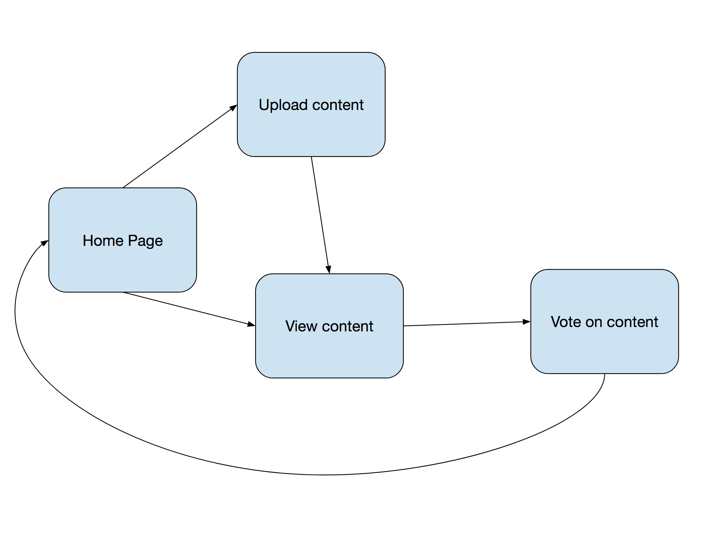
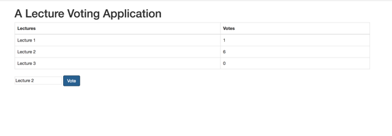

# ChalkChain

Sarah Young and Arissa Wongpanich

## Overview
_ChalkChain_ is a decentralized web app where students can upload their own webcasts, notes, and other lecture materials to share with their peers. Students also vote on the quality of the lecture materials uploaded to allow other students to select the best material to look through. If an upload reaches a certain number of votes, the user who uploaded it will get a payout in ETH.

This is helpful for students who are taking classes that aren't webcast and want to rewatch lectures in order to study for midterms, or who happen to be absent and want to catch up on the material. Rewarding high-quality content with ETH provides an incentive for democratizing lecture materials!

## Architecture
We will have 2 smart contracts.

The UploadLecture contract handles users uploading webcasts and notes to the app. If the uploaded content receives a certain number of votes, the user who uploaded it will receive some amount of ETH.

The Vote smart contract is for users voting on the quality of lecture material, and keeping track of which materials have been upvoted the most.

# Additional components
## Frontend
To design this user interface for this DApp, we plan to use the JavaScript framework Bootstrap.

Here is an image of the completed front end:

